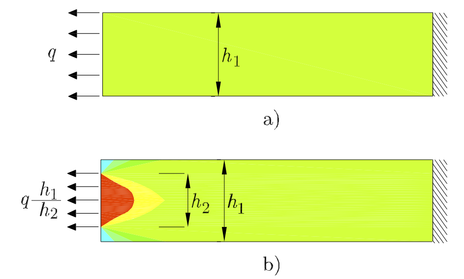

Introducción
============

Objeto de la RM
________________

.. glossary::

    Rigidez

Propiedad que presenta el material de oponerse a las deformaciones.

.. glossary::

    Estabilidad

Capacidad de oposición del elemento a grandes desplazamientos como consecuencia de pequeñas variaciones de
la solicitación exterior. El cálculo de la estabilidad de la pieza permitirá conocer su capacidad de conservar
las formas de equilibrio que adopta en estado deformado.

.. glossary::

    Resistencia de Materiales

La Resistencia de Materiales tiene como objetivo estudiar el comportamiento de los sólidos deformables y establecer
los criterios que nos permitan determinar el material más conveniente, la forma y las dimensiones más adecuadas que
hay que dar a estos sólidos cuando se les emplea como elementos de una construcción o de una máquina para que puedan
resistir la acción de una determinada solicitación exterior, así como obtener este resultado de la forma más
económica posible.

Permite determinar en una pieza sometida a un sistema dado de fuerzas exteriores:

#. los esfuerzos interiores que se engendran en la pieza
#. las deformaciones que se originan

**Es la ciencia que trata del cálculo de la resistencia mecánica, rigidez y estabilidad de las piezas de una estructura**.

Objetivos:

Son la resolución de los dos problemas fundamentales siguientes:

#. *Problema de dimensionamiento*: Conocido el sistema de cargas que solicita a una pieza de una estructura,
   calcular sus dimensiones para que las tensiones o esfuerzos internos unitarios y las deformaciones que se originan
   no sobrepasen unos valores límites fijados de antemano.

#. *Problema de comprobación*: Conocida la solicitación exterior y hecho el dimensionamiento de la pieza,
   comprobar que las tensiones y deformaciones no sobrepasan los valores límites prefijados.

Concepto de sólido en RM
________________________

.. glossary::

    Sólido rígido

Aquel que ante cualquier esfuerzo (por grande que sea) a que está sometido, la distancia entre dos moléculas
cualesquiera permanece invariable.

.. glossary::

    Sólido elástico

Aquel que ante un esfuerzo exterior se deforma y recupera su forma primitiva al cesar la causa exterior.

.. glossary::

    Sólido verdadero

Aquel que resulta de considerarlo como deformable ante los esfuerzos a que está sometido y falto de isotropía, homogeneidad y continuidad.

.. topic:: Importante

   Los materiales a que nos refiramos en lo sucesivo los consideraremos como sólidos elásticos.

Prisma Mecánico
_______________

.. glossary::

    Prisma Mecánico

Sólido engendrado por una sección plana :math:`\Sigma` de área  :math:`\Omega` cuyo centro de gravedad *G* describe una curva *c*
llamada *línea media o directriz*, siendo el plano que contiene a :math:`\Sigma` normal a la curva (:numref:`prismamecanico`).

.. _prismamecanico:
.. figure:: Figuras/1.jpg
   :figwidth: 80%
   :scale: 40 %
   :alt: Concepto de deformación
   :align: center

   Concepto de prisma mecánico

Forma:

* Alabeado: Línea media alabeada
* Plano: Línea media en un plano
* Recto: Línea media recta

Si :math:`\Sigma` constante: prisma de sección constante, si no, prisma de sección variable.

Tipos:

* Barra. Se llama así al prisma mecánico cuyas dimensiones de la sección transversal son pequeñas en comparación
  con la longitud de la línea media

* Placa. Es un cuerpo limitado por dos planos cuya distancia —el espesor— es pequeña en comparación con las otras
  dos dimensiones.

* Cáscara. Es un cuerpo limitado por dos superficies no planas a distancia pequeña en comparación con las otras
  dos dimensiones

Equilibrio estático y equilibrio elástico
_________________________________________

Equilibrio estático
^^^^^^^^^^^^^^^^^^^

Condiciones generales del equilibrio estático (necesarias y suficientes):

.. math::
   :label: equilibrioestatico

    \begin{equation}
        \left.
            \begin{array}{lllll}
                R_{x}=0 &; &    R_{y}=0& ;   &  R_{z}=0\\
                M_{ox}=0 & ; &  M_{oy}=0  &; &  M_{oz}=0
            \end{array}
        \right.
    \end{equation}

#. Que la suma de todas las fuerzas que actúan sobre el sólido =0, resultante =0. Esta condición asegura que
   el sólido no tenga desplazamientos.
#. Que el momento resultante de todas las fuerzas respecto de cualquier punto =0. Esta condición asegura que
   el sólido no experimenta giros.

Equilibrio elástico
^^^^^^^^^^^^^^^^^^^

Si suponemos realizado en el sólido un corte ideal y prescindimos de una de las partes,
es necesario que el sistema de fuerzas interiores en los puntos de la sección ideal sea equivalente
al sistema de fuerzas que actúan sobre la parte eliminada.

Además de las condiciones del equilibrio estático, debe existir equilibrio entre las fuerzas exteriores y
las internas en cada una de las infinitas secciones.

Es necesario que las fuerzas exteriores que actúan sobre el sólido sean contrarrestadas por
las fuerzas interiores de cohesión molecular.

Estado  de tensiones
____________________

.. _estadodetesional:
.. figure:: Figuras/2.jpg
   :figwidth: 80%
   :scale: 30 %
   :alt: Concepto de deformación
   :align: center

   Estado tensional de prisma mecánico

.. glossary::

    Tensión

Se define como tensión en el punto P según el plano :math:`\pi` al siguiente límite:

.. math::
   :label: deftension

    \begin{equation}
        \vec{\sigma}=\lim_{\Delta \Omega \to 0}\dfrac{\Delta \vec{f}}{d\Omega}=\dfrac{d \vec{f}}{d\Omega}
    \end{equation}

.. glossary::

    Tensión normal

La componente de :math:`\sigma`, según la normal al plano :math:`\pi`.se representa por :math:`\sigma_n`

.. glossary::

    Tensión tangencial

Proyección de :math:`\sigma` sobre el plano :math:`\pi`. También se llama *tensión cortante* y
se representa por :math:`\tau`

:math:`\sigma_n` y :math:`\tau` son las componentes intrínsecas de :math:`\sigma`

Si ahora consideramos el entorno de un punto P interior del prisma de aristas paralelas a los ejes
de un sistema cartesiano 0xyz, sobre cada una de sus caras existe un vector tensión cuyas componentes
intrínsecas normales tendrán las direcciones de los ejes coordenados respectivos y las tangenciales
se podrán descomponer a su vez en las direcciones de los dos ejes paralelos a la cara que se considere
(:numref:`estadodeenprisma`).

.. _estadodeenprisma:
.. figure:: Figuras/3-1.jpg
   :figwidth: 80%
   :scale: 35 %
   :alt: Concepto de deformación
   :align: center

   Tensiones sobre las caras del paralelépıpedo elemental:

Las tensiones en las caras normales a los ejes "x", "y" y "z" son:

.. math::
   :label: tensionesnormalejes

    \begin{equation}
        \begin{array}
            \sigma_{nx}^{*} = \sigma_{nx}+\dfrac{\partial\sigma_{nx}}{\partial x}dx &;& \sigma_{ny}^{*} = \sigma_{ny}+\dfrac{\partial\sigma_{ny}}{\partial y}dy&;&\sigma_{nz}^{*}  = \sigma_{nz}+\dfrac{\partial\sigma_{nz}}{\partial z}dz\\
            \tau_{xy}^{*} = \tau_{xy}+\dfrac{\partial\tau_{xy}}{\partial x}dx & ;& \tau_{yx}^{*}  = \tau_{yx}+\dfrac{\partial\tau_{yx}}{\partial y}dy &;&\tau_{zx}^{*}  = \tau_{zx}+\dfrac{\partial\tau_{zx}}{\partial z}dz \\
            \tau_{xz}^{*} = \tau_{xz}+\dfrac{\partial\tau_{xz}}{\partial x}dx &;& \tau_{yz}^{*} = \tau_{yz}+\dfrac{\partial\tau_{yz}}{\partial y}dy&;&\tau_{zy}^{*}  = \tau_{zy}+\dfrac{\partial\tau_{zy}}{\partial z}dz\\
        \end{array}
    \end{equation}

También sobre el paralelepípedo actúan fuerzas de masa por unidad de volumen :math:`f_v`,
y componentes cartesianas :math:`f_x`, :math:`f_y`, :math:`f_z`.

Planteando las condiciones de equilibrio estático del paralelepípedo aislado,
del equilibrio de fuerzas se obtienen las ecuaciones de equilibrio interno:

.. math::
   :label: equilibriointerno

    \begin{equation}
        \begin{split}
            (\sigma_{nx}^{*}-\sigma_{nx})dydz+(\tau_{yx}^{*}-\tau_{yx} )dzdx+(\tau_{zx}^{*}-\tau_{zx})dxdy+f_x dxdydz=0 \\
            (\tau_{nx}^{*}-\tau_{nx} )dydz+(\sigma_{ny}^{*}-\sigma_{ny})dzdx+(\tau_{zy}^{*}-\tau_{zy})dxdy+f_y dxdydz=0 \\
            (\tau_{xz}^{*}-\tau_{xz} )dydz+(\tau_{yz}^{*}-\tau_{yz})dzdx+(\sigma_{nz}^{*}-\sigma_{nz})dxdy+f_z dxdydz=0 \\
        \end{split}
    \end{equation}

Sustituyendo :eq:`tensionesnormalejes` en :eq:`equilibriointerno`
se llega a:

.. math::
   :label: equilibriointerno1

    \begin{equation}
        \begin{split}
            f_x+\dfrac{\partial\sigma_{nx}}{\partial x}+\dfrac{\partial\tau_{xy}}{\partial x} +\dfrac{\partial\tau_{xz}}{\partial z} & = 0 \\
            f_y+\dfrac{\partial\tau_{yx}}{\partial x} +\dfrac{\partial\sigma_{ny}}{\partial y}+\dfrac{\partial\tau_{yz}}{\partial z} & = 0 \\
            f_z+\dfrac{\partial\tau_{zx}}{\partial x} +\dfrac{\partial\tau_{zy}}{\partial y} +\dfrac{\partial\sigma_{nz}}{\partial z} & = 0 \\
        \end{split}
    \end{equation}

Tomando momentos respecto a los ejes "x", "y" y "z" y planteando el equilibrio se tiene que:

.. math::
   :label: equilibriodemomentos

    \begin{equation}
        \begin{split}
            (\tau_{yz}dxdz)dy- (\tau_{zy}dxdy)dz& = 0 \\
            (\tau_{zx}dxdy)dy- (\tau_{zx}dxdy)dz& = 0 \\
            (\tau_{xy}dydz)dy- (\tau_{yx}dxdz)dy& = 0 \\
        \end{split}
    \end{equation}

de donde:

.. math::
   :label: tensionestang

    \begin{equation}
        \left.
        \begin{array}{lllll}
            \tau_{yz}=\tau_{zy}& ;& \tau_{zx}=\tau_{xz}& ;& \tau_{xy}=\tau_{yx}
        \end{array}
        \right.
    \end{equation}

La expresión :eq:`tensionestang` es conocida como el *teorema de reciprocidad de las tensiones tangenciales*:
las componentes de las tensiones cortantes en un punto correspondientes a dos planos perpendiculares,
en dirección normal a la arista de su diedro, son iguales.

De los 9 valores que definen el estado tensional de un punto, 6 son independientes.

:math:`\sigma_{nx}`,  :math:`\sigma_{ny}`, :math:`\sigma_{nz}`, :math:`\tau_{xy}`, :math:`\tau_{xz}` y :math:`\tau_{yz}`

El conocimiento de los mismos permite conocer el vector tensión :math:`\vec{\sigma}` (:math:`\sigma_{x}`, :math:`\sigma_{y}`, :math:`\sigma_{z}`)
correspondiente a una orientación genérica
definida por el vector unitario normal :math:`\vec{u}`, (:math:`\alpha`, :math:`\beta`, :math:`\gamma`)
mediante la expresión:

.. math::
   :label: tensionesmatricial

    \begin{equation}
       \begin{pmatrix}
            \sigma_x\\
            \sigma_y\\
            \sigma_z
        \end{pmatrix}
        =
        \begin{pmatrix} % O matrices como esta de 4 x 3
            \sigma_{nx} & \tau_{yx} &\tau_{zx}  \\
            \tau_{xy} & \sigma_{ny} &\tau_{zy} \\
            \tau_{xz} & \tau_{yz}& \sigma_{nz}
        \end{pmatrix}
        \begin{pmatrix}
            \alpha \\
            \beta\\
            \gamma
        \end{pmatrix}
    \end{equation}

.. math::
   :label: tensor

    \begin{equation}
    [\vec{\sigma}]=[T][\vec{u}]
    \end{equation}

.. glossary::

    Tensor de tensiones

.. math::
   :label: tensordetensiones

    \begin{equation}
        [T]=
        \begin{pmatrix} % O matrices como esta de 4 x 3
            \sigma_{nx} & \tau_{yx} &\tau_{zx}  \\
            \tau_{xy} & \sigma_{ny} &\tau_{zy} \\
            \tau_{xz} & \tau_{yz}& \sigma_{nz}
        \end{pmatrix}
    \end{equation}

De los infinitos planos que pasan por P existen tres, ortogonales entre sí, para los cuales los vectores tensión
correspondientes son normales a ellos y carecen de componente tangencial.

Los vectores propios son los que definen estas tres direcciones (llamadas también direcciones principales).
El tensor de tensiones será diagonal.

.. glossary::

tensiones principales

y los valores propios son los valores de las *tensiones principales*, una máxima, otra mínima y otra intermedia.

.. math::

    \begin{equation}
        [\vec{\sigma}]=[T][\vec{u}]
    \end{equation}

.. math::

    \begin{equation}
        [\vec{\sigma}]=[\sigma][\vec{u}]
    \end{equation}

.. math::

    \begin{equation}
        [T][\vec{u}]=[\sigma][\vec{u}]
    \end{equation}

.. math::

    \begin{equation}
        [T-\sigma I][\vec{u}]=0
    \end{equation}

.. math::

    \begin{equation}
        \begin{bmatrix} %
            \sigma_{nx} -\sigma & \tau_{yx} &\tau_{zx}  \\
            \tau_{xy} & \sigma_{ny} -\sigma &\tau_{zy} \\
            \tau_{xz} & \tau_{yz} & \sigma_{nz}-\sigma
        \end{bmatrix}
        \begin{bmatrix}
            \alpha \\
            \beta\\
            \gamma
        \end{bmatrix}
            =
        \begin{bmatrix}
            0\\
            0\\
            0
        \end{bmatrix}
    \end{equation}

.. math::

    \begin{equation}
        \left.
        \begin{array}{l}
            (\sigma_{nx}-\sigma) +\tau_{xy} \beta+\tau_{zx}\gamma  =0 \\
            \tau_{xy}\alpha+ (\sigma_{ny}-\sigma)\beta + \tau_{yz}\gamma  =0\\
            \tau_{zx}\alpha+\tau_{yz}\beta+(\sigma_{nz}-\sigma)\gamma  =0
        \end{array}
    \right\}.
    \end{equation}

Las tensiones principales se obtienen de obtener las raíces del polinomio característico consecuencia de resolver
:eq:`polinomiotensiones`:

.. math::
   :label: polinomiotensiones

    \begin{equation}
        \left|
        \begin{array}{ccc}
            \sigma_{nx} -\sigma & \tau_{yx} &\tau_{zx}  \\
            \tau_{xy} & \sigma_{ny} -\sigma &\tau_{zy} \\
            \tau_{xz} & \tau_{yz} & \sigma_{nz}-\sigma
        \end{array}
        \right|=0
    \end{equation}

Las tensiones principales son las tensiones correspondientes a los planos normales a las direcciones principales.

Estado  de deformación
________________________

Sea un sólido elástico no sometido a solicitación alguna y sin que se haya producido en él ninguna deformación.

.. _deformacion:
.. figure:: Figuras/4.jpg
   :figwidth: 80%
   :scale: 35 %
   :alt: Concepto de deformación
   :align: center

.. math::

    \begin{equation}
        P\vec{Q}=\vec{dr}=dx\vec{i}+dy\vec{j}+dz\vec{k}
    \end{equation}

.. math::

    \begin{equation}
        \vec{dr'}=\vec{dr}+[H]\vec{dr}+[D]\vec{dr}
    \end{equation}

donde:

.. math::

    \begin{equation}
        [H] =
        \begin{pmatrix}
            0 & \dfrac{1}{2} \left(\dfrac{ \partial{u}}{\partial{y}}+\dfrac{ \partial{v}}{\partial{x}}\right) & \dfrac{1}{2} \left(\dfrac{ \partial{u}}{\partial{z}}+\dfrac{ \partial{w}}{\partial{x}}\right) \\
            \dfrac{1}{2} \left(\dfrac{ \partial{u}}{\partial{y}}+\dfrac{ \partial{v}}{\partial{x}}\right) & 0  & \dfrac{1}{2} \left(\dfrac{ \partial{v}}{\partial{z}}+\dfrac{ \partial{w}}{\partial{y}}\right) \\
            \dfrac{1}{2} \left(\dfrac{ \partial{w}}{\partial{x}}+\dfrac{ \partial{u}}{\partial{z}}\right)& \dfrac{1}{2} \left(\dfrac{ \partial{w}}{\partial{y}}+\dfrac{ \partial{v}}{\partial{z}}\right) & 0
        \end{pmatrix}
    \end{equation}

y

.. math::

    \begin{equation}
        [D] =
        \begin{pmatrix}
            \dfrac{ \partial{u}}{\partial{x}} & \dfrac{1}{2} \left(\dfrac{ \partial{u}}{\partial{y}}+\dfrac{ \partial{v}}{\partial{x}}\right) & \dfrac{1}{2} \left(\dfrac{ \partial{u}}{\partial{z}}+\dfrac{ \partial{w}}{\partial{x}}\right) \\
            \dfrac{1}{2} \left(\dfrac{ \partial{u}}{\partial{y}}+\dfrac{ \partial{v}}{\partial{x}}\right) & \dfrac{ \partial{v}}{\partial{y}}  & \dfrac{1}{2} \left(\dfrac{ \partial{v}}{\partial{z}}+\dfrac{ \partial{w}}{\partial{y}}\right) \\
            \dfrac{1}{2} \left(\dfrac{ \partial{w}}{\partial{x}}+\dfrac{ \partial{u}}{\partial{z}}\right)& \dfrac{1}{2} \left(\dfrac{ \partial{w}}{\partial{y}}+\dfrac{ \partial{v}}{\partial{z}}\right) & \dfrac{ \partial{w}}{\partial{z}}
        \end{pmatrix}
    \end{equation}

:math:`\vec{dr}`, pasa a :math:`\vec{dr'}` mediante los siguientes pasos (:numref:`deformacion1`).:

.. _deformacion1:
.. figure:: Figuras/5.jpg
   :figwidth: 80%
   :scale: 35 %
   :alt: Concepto de deformación
   :align: center

   Transformación de :math:`\vec{dr}` a :math:`\vec{dr'}`

#. Una traslación definida por el vector desplazamiento :math:`\vec{\delta_p}` del punto P mediante la cual :math:`\vec{PQ}` pasa
   a :math:`\vec{P'Q_1}`.
#. Un giro determinado por la matriz hemisimétrica [H] por el que :math:`\vec{P'Q_1}` pasa a :math:`\vec{P'Q_2}`.
#. Una dilatación definida por la matriz simétrica [D] mediante la cual :math:`\vec{P'Q_2}` pasa
   finalmente a la posición :math:`\vec{P'Q'}`.

Lo único que tiene influencia en la deformación es la transformación :math:`[D]\vec{P'Q_2}` de ahí que
la matriz [D] se denomine matriz de deformación.

.. glossary::

    Tensor de deformaciones

.. math::
    \begin{equation}
        [D] =
        \begin{pmatrix}
            \epsilon_x & \dfrac{1}{2} \gamma_{xy} & \dfrac{1}{2} \gamma_{xz} \\
            \dfrac{1}{2} \gamma_{xy} & \epsilon_y &\dfrac{1}{2} \gamma_{yz} \\
            \dfrac{1}{2} \gamma_{xz} &\dfrac{1}{2} \gamma_{yz} & \epsilon_z
        \end{pmatrix}
    \end{equation}

* :math:`\epsilon_x`, :math:`\epsilon_y` y :math:`\epsilon_z`: deformaciones longitudinales unitarias en las
  direcciones de los ejes coordenados respectivos
* :math:`\gamma_{xy}`, :math:`\gamma_{xz}` y :math:`\gamma_{yz}`: variaciones an- gulares experimentadas por
  ángulos inicialmente rectos de lados paralelos a los ejes coordenados x, y; x, z, e y, z, respectivamente.

Al igual que con el tensor de tensiones, existen unas direcciones principales o autovectores de la matriz [D]
que se obtienen resolviendo el sistema de ecuaciones:

.. math::

    \begin{equation}
        \left.
        \begin{array}{c}
        (\varepsilon_x-\varepsilon)\alpha+\dfrac{1}{2}\gamma_{xy}\beta+\dfrac{1}{2}\gamma_{zx}\gamma=0 \\
        \dfrac{1}{2}\gamma_{xy}\alpha+(\varepsilon_y-\varepsilon)\beta+\dfrac{1}{2}\gamma_{yz}\gamma=0\\
        \dfrac{1}{2}\gamma_{zx}\alpha+\dfrac{1}{2}\gamma_{yz}\beta+(\varepsilon_z-\varepsilon)\gamma=0
        \end{array}
        \right\}
    \end{equation}

Las raíces de la ecuación característica:

.. math::
    \begin{equation}
        \left|
        \begin{array}{ccc}
            \varepsilon -\varepsilon_x & \dfrac{1}{2}\gamma_{xy} & \dfrac{1}{2}\gamma_{zx}\\
            \dfrac{1}{2}\gamma_{xy} &\varepsilon -\varepsilon_y & \dfrac{1}{2}\gamma_{yz} \\
            \dfrac{1}{2}\gamma_{zx} &  \dfrac{1}{2}\gamma_{yz} & \varepsilon -\varepsilon_z
        \end{array}
        \right|=0
    \end{equation}

son las *deformaciones principales*.

.. glossary::

    Deformaciones principales

Son las deformaciones longitudinales unitarias correspondientes a las direcciones principales.

.. glossary::

    Deformación unitaria

En un punto P interior al sólido elástico, se define el vector deformación unitaria en la dirección determinada
por :math:`\Delta\vec{r}` como:

.. math::
    \begin{equation}
        \vec{\varepsilon}=
        \lim_{\vert\Delta\vec{r}\vert \to 0}\dfrac{\Delta\vec{r}}{\vert\Delta\vec{r}\vert}=
        [D]\lim_{\vert\Delta\vec{r}\vert \to 0}\dfrac{\Delta\vec{r}}{\vert\Delta\vec{r}\vert}=
        [D]\dfrac{\vec{dr}}{\vert \vec{dr}\vert}=[D][\vec{u}]
    \end{equation}

siendo :math:`\vec{u}` el vector unitario en la dirección de :math:`\vec{dr}`.

Principios de la RM
___________________

Principio de rigidez relativa de los sistemas elásticos
^^^^^^^^^^^^^^^^^^^^^^^^^^^^^^^^^^^^^^^^^^^^^^^^^^^^^^^

Al aplicar el sistema exterior de fuerzas la forma del sólido no varía de forma significativa.
Por ello, se expresan las condiciones de equilibrio como si el sólido deformado tuviera la misma forma y
dimensiones que antes de producirse la deformación (:numref:`prigidez`).

.. _prigidez:

   Principio de rigidez relativa

Principio de superposición de efectos
^^^^^^^^^^^^^^^^^^^^^^^^^^^^^^^^^^^^^

Los desplazamientos y las tensiones en un punto de un sólido elástico sometido a varias fuerzas exteriores
directamente aplicadas son, respectivamente, la suma de los desplazamientos y las tensiones que se producen en dicho
punto por cada fuerza actuando aisladamente.

Excepciones:

Los casos en los que no sea aplicable el principio de rigidez ni en los casos en los que los efectos de las
fuerzas no sean independientes de las deformaciones como ocurre en la viga recta AB indicada en la (:numref:`nosuperposicion`)

.. _nosuperposicion:

   Aquí no se cumple el principio de superposición

Principio de Saint-Venant
^^^^^^^^^^^^^^^^^^^^^^^^^

A partir de una distancia suficiente de los puntos de la superficie de un sólido elástico en los que está aplicado
un determinado sistema de fuerzas, las tensiones y deformaciones son prácticamente iguales para todos los
sistemas de fuerzas que sean estáticamente equivalentes al dado.

.. _Venant:

   Principio de Saint-Venant

Relación entre tensión y de deformación. Ensayo de tracción
___________________________________________________________

.. _maquinatracción:

   Máquina empleada para realizar pruebas a tensión en probeta.

.. _probeta:
.. figure:: Figuras/9-2.jpg
   :figwidth: 80%
   :scale: 30 %
   :align: center

   Probeta típica para ensayo o prueba de tensión.

.. _probetaductil:
.. figure:: Figuras/9-3.jpg
   :figwidth: 80%
   :scale: 30 %
   :align: center

   Probeta después del ensayo de un material dúctil.

.. _probetafragíl:
.. figure:: Figuras/9-3.jpg
   :figwidth: 80%
   :scale: 30 %
   :align: center

   Probeta después del ensayo de un material frágil.

.. _ensayoacero:
.. figure:: Figuras/9.jpg
   :figwidth: 80%
   :scale: 40 %
   :align: center

   Ensayo de tracción en un probeta de acero

Se observa una zona de elasticidad proporcional en la que la relación tensión-deformación es lineal.

Dado que deformación y tensión son causa y efecto, las matrices de tensiones y de
deformación estén relacionadas entre sí.

.. glossary::

   Ley de Hooke

.. math::
    \begin{equation}
        \sigma_{nx}=E\epsilon_x
    \end{equation}

.. glossary::

   Módulo de Young

También llamado módulo de elasticidad longitudinal. Tiene dimensiones de una
tensión (:math:`[F ][L]^{−2}`) y es diferente para cada material.

En el mismo ensayo a tracción se observa que simultáneamente al alargamiento de la probeta se produce un
acortamiento de las dimensiones de la sección transversal. Para una pieza de sección rectangular (Fig. 1.20),
las deformaciones transversales unitarias se rigen por las expresiones:

.. math::
    \begin{equation}
            \begin{array}{l}
        \varepsilon_y=-\mu\dfrac{\sigma_{nx}}{E}\\
        \varepsilon_z=-\mu\dfrac{\sigma_{nx}}{E}
        \end{array}
    \end{equation}

donde :math:`\mu` es el

.. glossary::

   Coeficiente de Poisson.

Su valor para materiales isótropos es aproximadamente igual a 0,25. Para el acero dulce en deformaciones
elásticas se suele tomar el valor k = 0,3.

En ensayo a tracción se cumple que:  :math:`\sigma_1=\sigma_{nx}`, :math:`\sigma_2=\sigma_3=0`.

Si consideramos ahora un estado elástico tridimensional, se demuestra que las direcciones principales
de ambas matrices son coincidentes.

.. math::
    \begin{equation}
        \left\{
        \begin{array}{l}
            \varepsilon_1=\dfrac{1}{E}[\sigma_1-\mu(\sigma_2+\sigma_3)]\\
            \\
            \varepsilon_2=\dfrac{1}{E}[\sigma_2-\mu(\sigma_1+\sigma_3)]\\
            \\
            \varepsilon_3=\dfrac{1}{E}[\sigma_3-\mu(\sigma_1+\sigma_2)]
        \end{array}
        \right.
    \end{equation}

Si el sistema de ejes coordenados no coincide con las direcciones principales, las relaciones
entre las componentes de la matriz de tensiones [T] y de deformaciones [D] son:

.. glossary::

   Leyes de Hooke generalizadas

.. math::
    \begin{equation}
        \left\{
        \begin{array}{lll}
            \varepsilon_x=\dfrac{1}{E}[\sigma_{nx}-\mu(\sigma_{ny}+\sigma_{nz})]& ; & \gamma_{xy}=\dfrac{\tau_{xy}}{G}\\
            \\
            \varepsilon_y=\dfrac{1}{E}[\sigma_{ny}-\mu(\sigma_{nx}+\sigma_{nz})]& ; & \gamma_{yz}=\dfrac{\tau_{yz}}{G}\\
            \\
            \varepsilon_z=\dfrac{1}{E}[\sigma_{nz}-\mu(\sigma_{nx}+\sigma_{ny})]& ; & \gamma_{zx}=\dfrac{\tau_{zx}}{G}\\
        \end{array}
        \right.
    \end{equation}

en donde:

.. glossary::

   Módulo de elasticidad transversal

.. math::

    \begin{equation}
        G=\dfrac{E}{2(1+\mu)}
    \end{equation}

Tiene las mismas dimensiones  que E (:math:`[F ][L]^{−2}`) y es diferente para cada material.

Esfuerzos normal y cortante y momentos de flexión y de torsión
______________________________________________________________

.. _solidosolicitaciones:

   Sólido rígido sometido a diversas solicitaciones

.. _resultante:

   Resultante debida a la parte eliminada

.. math::

    \begin{equation}
        \vec{R}=N\vec{i}+T_y\vec{j}+T_z\vec{k}
    \end{equation}

.. glossary::

   Esfuerzo normal

N, llamado esfuerzo normal, por serlo a la superficie de la sección considerada, tiende a
empujar o separar a ambas partes del prisma dando lugar a esfuerzos de compresión o tracción, respectivamente.

.. glossary::

   Esfuerzo cortante

.. math::

    \begin{equation}
        \vec{T}=T_y\vec{j}+T_z\vec{k}
    \end{equation}

T, esfuerzo que actúa tangencialmente a la superficie de la sección.

.. _resultantemomentos:

   Momentos debidos a la parte eliminada

.. math::

    \begin{equation}
        \vec{M}=M_T\vec{i}+M_y\vec{j}+M_z\vec{k}
    \end{equation}

.. glossary::

   Momento torsor

:math:`M_T`: tiende a hacer girar el sólido sobre sí mismo, creando un efecto de torsión.

.. glossary::

   Momento flector

.. math::

    \begin{equation}
        \vec{M_F}=M_y\vec{j}+M_z\vec{k}
    \end{equation}

:math:`M_F`: :math:`M_y` y :math:`M_z` tienden a obligar al sólido a girar lateralmente curvándolo en los planos xz y xy.
Momentos flectores.

.. _relacion:
.. figure:: Figuras/13.jpg
   :figwidth: 80%
   :scale: 40 %
   :alt: Concepto de deformación
   :align: center

   Relación entre R, M y la matriz de tensiones

.. math::
    \begin{equation}
        \begin{array}{lllll}
            N=\int \int_{\Omega }^{ }  \sigma _{nx}d\Omega & ;&T_y=\int \int_{\Omega }^{ }  \tau _{xy}d\Omega  & ;& T_z=\int \int_{\Omega }^{ }  \tau _{xz}d\Omega \\
        \end{array}
    \end{equation}

Tomando momentos respecto a G se obtienen las expresiones de los momentos torsor :math:`M_T`
y flectores :math:`M_y` y :math:`M_z`:

.. math::

    \begin{equation}
        \vec{M}= \int \int_{\Omega } (\vec{r}x\sigma)=\int \int_{\Omega }
        \left|
        \begin{array}{ccc}
            \vec{i} & \vec{j} &\vec{k}  \\
            0  & y & z \\
            \sigma_{nx} & \tau_{xy} & \tau_{zx}
        \end{array}
        \right|d\Omega=
        \vec{i}\int \int_{\Omega } (y\tau_{zx}-z\tau_{xy})d\Omega+
        \vec{j}\int \int_{\Omega } z\sigma_{nx}d\Omega-
        \vec{k}\int \int_{\Omega } y\sigma_{nx}d\Omega
    \end{equation}

de donde se tiene que:

.. math::

    \begin{equation}
        \left.
        \begin{array}{l}
            M_T= \int \int_{\Omega } (y\tau_{zx}-z\tau_{xy})d\Omega     \\
            M_y= \int \int_{\Omega } \sigma_{nx}zd\Omega                \\
            M_z= \int \int_{\Omega } \sigma_{nx}yd\Omega
        \end{array}
        \right\}
    \end{equation}

Tipos de solicitaciones exteriores
__________________________________

* Cargas:  fuerzas activas o directamente aplicadas
* Reacciones: fuerzas debidas a las ligaduras

En general estarán formadas en general por una fuerza y un momento.

Dentro de las cargas:

* Fuerzas de volumen: :math:`f_v`: en general será función de la posición del punto,
  sobre cada elemento de volumen dv del prisma estará aplicada la fuerza :math:`f_vdv`
* Fuerzas de superficie: se aplican a la superficie exterior del prisma.
    * Concentradas
    * Repartidas

En función de la continuidad de actuación sobre la estructura:

* Cargas permanentes
* Cargas accidentales o sobrecargas

Si existen o no fuerzas de inercia:

* Cargas estáticas
* Cargas dinámicas

Tipos de apoyos
_______________

En cada ligadura existe una reacción que, en general, estará formada por una fuerza y por un momento.
Una sección no sometida a ligadura alguna tiene 6 g.d.l. (3 desplazamientos y 3 giros).

.. _6impedidos:
.. figure:: Figuras/14.jpg
   :figwidth: 80%
   :scale: 40 %
   :alt: Concepto de deformación
   :align: center

   6 g.d.l. impedidos

.. _3impedidos:
.. figure:: Figuras/15.jpg
   :figwidth: 80%
   :scale: 40 %
   :alt: Concepto de deformación
   :align: center

   3 g.d.l. impedidos (los desplazamientos)

Apoyo articulado móvil
^^^^^^^^^^^^^^^^^^^^^^

Es libre el movimiento de la sección en la dirección del eje x y el giro en el plano xy.
La reacción se reduce a una fuerza perpendicular al posible desplazamiento del apoyo.
Equivale, por tanto, a una incógnita: el módulo de la reacción.

.. _Apoyoarticuladomóvil:

   Apoyo articulado móvil

Apoyo articulado fijo
^^^^^^^^^^^^^^^^^^^^^

Desplazamiento impedido tanto en la dirección del eje x como en la del eje y,
pero el giro en el plano xy no lo está.
La reacción es en este caso una fuerza de componentes :math:`RA_x` y :math:`RA_y`.
Equivale a dos incógnitas.

.. _Apoyoarticuladofijo:
.. figure:: Figuras/17.jpg
   :figwidth: 80%
   :scale: 40 %
   :alt: Concepto de deformación
   :align: center

   Apoyo articulado fijo

Apoyo empotrado
^^^^^^^^^^^^^^^

Impedidos los desplazamientos en las direcciones de los ejes x e y, y el giro en el plano xy.
La sección A del apoyo queda inmovilizada.

La reacción se compone de una fuerza :math:`\vec{R_A}`, de componentes :math:`RA_x` y :math:`RA_y`,
y de un momento :math:`\vec{M_A}` perpendicular al plano xy.
Equivale a 3 incógnitas.

.. _empotramiento:

   Empotramiento

Sistemas isostáticos e hiperestáticos
_____________________________________

En general el número ecuaciones de que se dispone para determinar las correspondientes incógnitas son 6,
(condiciones de equilibrio) de la pieza.
Con secciones con plano medio de simetría  y las cargas contenidas en dicho plano,
el número de ecuaciones disponibles disminuye a 3.

.. glossary::

   Sistemas isostáticos

Sistemas tales que la sóla aplicación de las ecuaciones de la Estática permiten determinar
las reacciones de las ligaduras.

.. glossary::

   Sistemas hiperestáticos

Si existen ligaduras exteriores superabundantes, el número de incógnitas supera al de ecuaciones de equilibrio.
Para la determinación de las reacciones será necesario hacer intervenir las deformaciones.

.. glossary::

   Grado de hiperestaticidad

Es el exceso de incógnitas respecto al número de ecuaciones de equilibrio.

.. _ejemploshiperestaticidad:
.. figure:: Figuras/19.jpg
   :figwidth: 80%
   :scale: 40 %
   :alt: Concepto de deformación
   :align: center

   a ) g.h.=0 (isostático); b ) g.h.=1; c ) g.h.=1; d ) g.h.=2; e ) g.h.=3; f ) g.h.=0 (isostático)

Coeficiente de seguridad y Tensión admisible
____________________________________________

.. glossary::

   Tensión admisible

.. math::

    \begin{equation}
        \sigma_{adm}=\frac{\sigma_{lim}}{n}
    \end{equation}

* Si materiales frágiles: :math:`\sigma{lim}=\sigma_{r}`
* Si materiales dúctiles: :math:`\sigma{lim}=\sigma_{e}`

.. glossary::

   Coeficiente de seguridad

n coeficiente de seguridad

.. glossary::

   Resistencia característica

El valor tal que la probabilidad de obtener valores inferiores a él es del 5 por 100.
Una vez obtenida la resistencia característica, se toma como tensión de cálculo :math:`\sigma_{u}`

.. math::

    \begin{equation}
        \sigma_{y}=\frac{\text{resistencia caracteristica}}{\text{coeficiente de minoracion}}
    \end{equation}

Criterios de resistencia. Concepto de tensión equivalente
_________________________________________________________

.. glossary::

   Tensión equivalente

:math:`\sigma_{equiv}`: La que existiría en una probeta de ese material sometido a tracción tal que el coeficiente de seguridad del
estado tensional dado y el de la probeta a tracción fuera el mismo.

.. _tensionequivalente:
.. figure:: Figuras/20.jpg
   :figwidth: 80%
   :scale: 40 %
   :alt: Concepto de deformación
   :align: center

   Tensión equivalente
